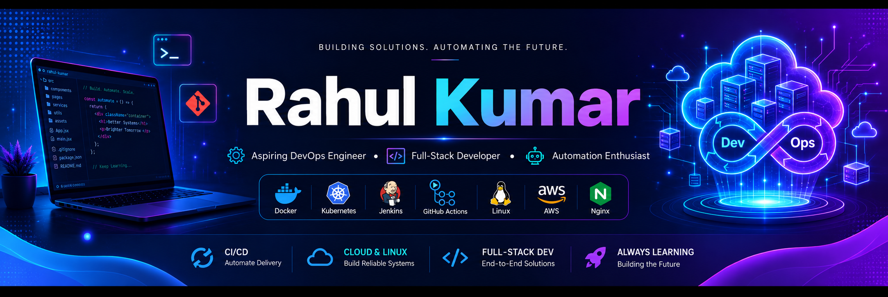

<div align="center">

<!-- ── CUSTOM BANNER ────────────────────────────────────────────────────────── -->



<br>


<br><br>

### 💡 DSA • DevOps • Full-Stack Development • AI & Automation

<br>

<a href="https://www.linkedin.com/in/rahul-kumar-50275b380/">
  
</a>

<a href="mailto:r26056824@gmail.com">
  
</a>

<a href="https://leetcode.com/u/Rahul_Kumar_12/">
  
</a>

<a href="https://github.com/RahulKr2005">
  
</a>

<a href="https://freetictacgame.netlify.app/">
  
</a>

<br><br>


</div>
<div>
  ## 👋 About Me

Hi, I'm **Rahul Kumar**, a B.Tech CSE-DS student passionate about building software that solves real-world problems.

* 🤖 Interested in **Artificial Intelligence, Automation, and Backend Development**
* 💻 Building projects with **Java, Python, React, FastAPI, and AI technologies,DevOps, Linux, BashScripting**
* 🚀 Built applications used by students, including AI-powered educational tools and workflow automations
* 📚 Currently learning **MERN, Advanced DSA, and DevOps**
* 🎯 Aspiring Software Engineer focused on creating scalable and impactful products

### Recent Projects

* 📬 **Calc** — Calc for calculate maths problem
* 📝 **Game** — WebGame
* 🧠 **Task Manager** — Todo List type

> *"If a task can be automated, it should be automated."*

</div>

<!-- ── SKILLS ──────────────────────────────────────────────────────────────────── -->

## 🛠️ Tech Stack

### 💬 Languages
<p>
  
  
  
  
</p>

### 🎨 Frontend
<p>
  
  
  
  
  
</p>

### ⚙️ Backend & APIs
<p>
  
  
  
  
  
</p>

### 🤖 AI / ML
<p>
  
  
  
  
  
  
  
</p>

### 🗄️ Databases
<p>
  
  
  
  
</p>

### 🔧 DevOps & Tools
<p>
  
  
  
  
  
  
  
</p>

---

<!-- ── FEATURED PROJECTS ───────────────────────────────────────────────────────── -->


<!-- ── DSA JOURNEY ─────────────────────────────────────────────────────────────── -->

## 🧩 DSA & Problem Solving

<div align="center">

| Platform | Focus | Status |
|----------|-------|--------|
| 💛 **LeetCode** | Arrays · Trees · Graphs · DP · Sliding Window | 🟢 Active |
| ☕ **Language** | Java — clean, typed, interview-ready solutions | 🟢 Consistent |
| 🎯 **Target** | FAANG & Top-tier SWE Interview Prep | 🔥 In Progress |

</div>

> *"Consistency beats intensity. One problem a day keeps the rejection away."*

---

<!-- ── GITHUB STATS ────────────────────────────────────────────────────────────── -->

## 📊 GitHub Stats

<div align="center">


</div>

<div align="center">


</div>

<div align="center">


</div>

---

<!-- ── CURRENT FOCUS ───────────────────────────────────────────────────────────── -->

## 🌱 Currently Learning

<div align="center">

|  | What | Why It Matters |
|--|------|----------------|
| ☕ | **MERN** —  REST, JPA, security | Industry-standard  backend; powers half of enterprise SWE roles |
| 🧩 | **Advanced DSA in Java** — graphs, DP, tries, segment trees | Non-negotiable for FAANG-level interview loops |
| 🏗️ | **System Design** — HLD/LLD, scalability, caching, queues | Differentiates senior thinking from junior thinking |
| 🔬 | **LLM Fine-tuning & Agents** — LoRA, tool-use, multi-agent flows | Next frontier in production AI engineering |

</div>

```
Progress bars (self-assessed) ─────────────────────────────────────────────

MERN             ██████░░░░░░  40%  [ Actively building ]
Advanced DSA     ████████░░░░  60%  [ Daily grinding    ]
System Design    ██████░░░░░░  45%  [ Reading + notes   ]
LLM Fine-tuning  ████░░░░░░░░  30%  [ Experiments live  ]
DevOps           ████████░░░░  60%  [ Daily Learning    ]
```

---

<!-- ── 2026 GOALS ──────────────────────────────────────────────────────────────── -->

## 🎯 2026 Mission Board

<div align="center">

| Priority | Goal | Status |
|----------|------|--------|
| 🥇 | **Master DSA** — 500+ problems, own every pattern, pass FAANG screens cold | 🔥 Grinding |
| 🥈 | **Ship AI products** — production-grade, real users, measurable impact | 🚀 Shipping |
| 🥉 | **MERN proficiency** — REST, JWT, security| 📖 Learning |
| 🎖️ | **Open Source contributions** — AI tooling, backend libraries, developer tools | 🌱 Starting |
| 🏆 | **Top-tier SWE offer** — Google · Microsoft · Amazon · Adobe · Atlassian | 🎯 The Goal |

</div>

> 💬 *"Most people overestimate what they can do in a day and underestimate what they can do in a year.*
> *I'm betting on the year."*

---

<!-- ── FUN FACTS ────────────────────────────────────────────────────────────────── -->

## ⚡ Quick Facts

- 🤖 I build things that **read, understand, and respond** — OCR, RAG, AI agents
- 🔄 If I do something more than once, I **automate it**
- 📚 I'm as comfortable with **research papers** as I am with **production code**
- 🎯 I think in **systems** — not just features
- ☕ My debugging fuel: coffee + rubber duck + Stack Overflow (in that order)
- 🌙 Best code written: **after midnight** (don't tell my sleep schedule)

---

<!-- ── CONNECT ──────────────────────────────────────────────────────────────────── -->

## 🤝 Let's Connect

<div align="center">

<a href="https://www.linkedin.com/in/rahul-kumar-50275b380/">
  
</a>
&nbsp;
<a href="mailto:r26056824@email.com">
  
</a>
&nbsp;
<a href="https://leetcode.com/u/Rahul_Kumar_12/">
  
</a>
&nbsp;
<a href="https://usecalculatorapp.netlify.app/">
  
</a>

<br/><br/>
---

<p align="center">
  
</p>

*Open to internships, collaborations, AI project discussions, and good conversations about tech.*

</div>

---

<!-- ── FOOTER ──────────────────────────────────────────────────────────────────── -->

<div align="center">


<sub>⭐ <em>If any of my projects helped you, a star would mean a lot!</em> ⭐</sub>

</div>
